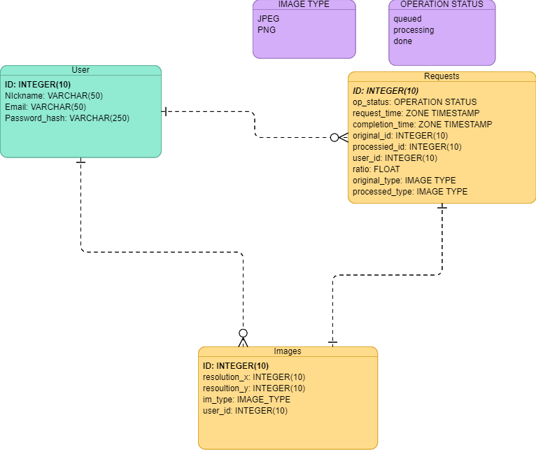
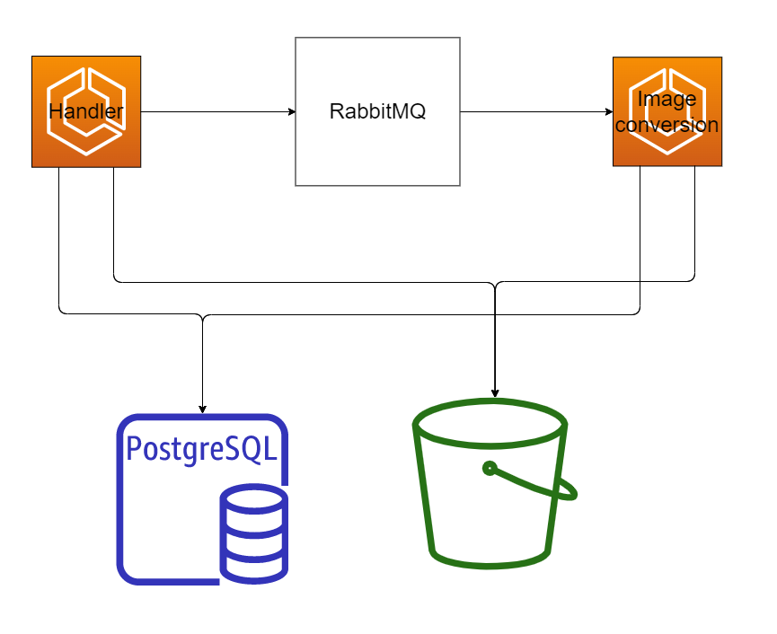
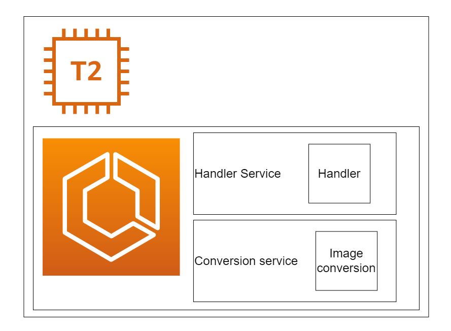
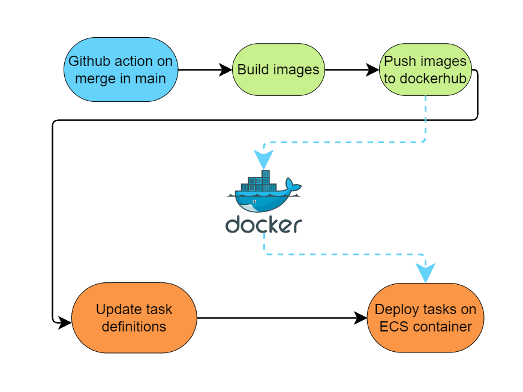

# Image converter
image-converter is an image conversion and compression service. The service should expose a
RESTful API to convert JPEG to PNG and vice versa and compress the image with the
compression ratio specified by the user. As a user you are able to see all yout requests
history and status and download the original image and the
processed one.  

> ## Environment file
To run this application you should specify .env file.
```
# Port to connect to
PORT=
# Salt for jwt token
SIGNEDKEY=
# database
DBHOST=
DBUSERNAME=
DBPASSWORD=
DBPORT=
DBNAME=
DBSSLMODE=
# If you want to use MINIO storage you should specify
MNHOST=
MNPORT=
MNCLPORT=
MNACCESSKEYID=
MNSECRETACCESSKEY=
MNUSESSL=
MNPATH=  #path to the folder where you wnat to store your files
# Aws keys
AWS_ACCESS_KEY_ID=
AWS_SECRET_ACCESS_KEY=
S3BUCKET=
# Keys to connect to the RabbitMQ broker 
RBHOST=
RBPORT=
RBUSER=
RBPASSWORD=
```
> ## Endpoints
| Endpoint |Method| Purpose |
|:----------|:--:|:-----------|
|auth/register | POST  | to register new user|
|auth/login | POST  | to login and get jwt key|
|requests/ | GET  | get all requsts|
|requests/{id} | GET | get request by it's id|
|requests/{id} | DELETE | delete reqeust by it's id|
|requests/image | POST | add convolutional reqeust|
|download/image/{id} | GET | donwload image by id|

To get more information about endpoints view [swagger documentation](docs/openapi.yaml)

> ## CLI
To interact with api you could use CLI.


All information how to use CLI is provided in CLI help.

> ## Architecture

Database structure


Service structure


Running structure


Deploy structure
